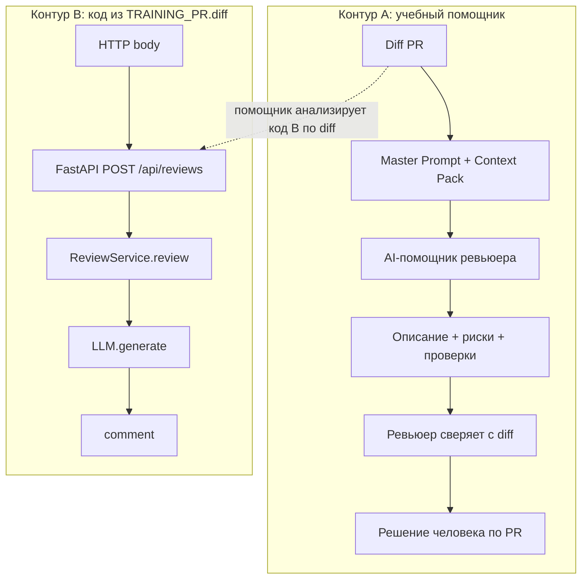

# ADR: решение для первого рабочего сценария

Артефакт Практики 1, доработанный шестью техниками Практики 2 (см. `practices/practice_02/`).

- Статус: **proposed** (учебный черновик; внешнее принятие в источниках не зафиксировано)
- Дата: 2026-09-20
- Ответственные: студент (владелец артефактов); AI — черновик анализа; решение по PR — только человек

## Контекст

Нужен способ ускорить подготовку ревью одного PR по diff так, чтобы замечания были доказуемы (файл, строка, цитата), а AI не подменял человека.

Во входе учебного PR (`TRAINING_PR.diff`) есть FastAPI `POST /api/reviews` и `ReviewService.review`, передающий diff в LLM. Учебный кейс README Практики 1 описывает **отдельного** AI-помощника ревьюера (формат ответа + границы). Это **два контура**, а не один подтверждённый runtime.

| Утверждение в контексте | Источник |
|---|---|
| Есть `POST /api/reviews` и `payload["diff"]` | `TRAINING_PR.diff` → `app/api.py` |
| Есть `ReviewService.review` и `llm.generate` | `TRAINING_PR.diff` → `app/review_service.py` |
| Помощник возвращает описание, ≤3 риска, проверки; без approve/merge | README Практики 1, учебный кейс |
| Чат-помощник и FastAPI — один прод-пайплайн | **Нет источника** → не утверждать |
| Желаемый HTTP-код при отсутствии `diff` | **Открытый вопрос** |

## Решение

Принять архитектуру «человек в контуре» с разделением контуров:

1. **Контур A (учебный помощник):** diff + Context Pack → черновик (описание, ≤3 риска с доказательством, проверки) → ревьюер сверяет с diff и принимает решение.
2. **Контур B (код из diff):** `POST /api/reviews` → `ReviewService.review` → `LLM.generate` → `{"comment": ...}`. Валидация входа и контракт ошибок — **Открытый вопрос** (отдельное решение, не часть этого ADR).
3. **Границы:** помощник не делает approve/merge и не меняет код.

### Формат записи решения (зафиксирован few-shot / RCTF)

Каждый пункт решения должен: называть контур (A/B), ссылаться на источник или «Открытый вопрос», не смешивать контуры в одной фразе без пометки.

## Рассмотренные альтернативы

| ID | Альтернатива | Суть | Плюсы | Минусы / риски | Решение |
|---|---|---|---|---|---|
| Alt-1 | Auto-merge/approve по вердикту LLM | LLM закрывает PR сам | Скорость | Нарушает границы курса; нет ответственности человека | Отклонена |
| Alt-2 | Только статический анализ без LLM | Линтеры/правила вместо помощника | Предсказуемость | Нет NL-описания и доказательных рисков в формате кейса | Отклонена сейчас (**Открытый вопрос** о комбинации) |
| Alt-3 | Zero-shot чат без Context Pack | Свободный запрос к модели | Простота | Слабая доказательность (P1-01) | Только как baseline |
| Alt-4 | Считать API из diff единственным UI помощника | Весь ревьюерский UX = `POST /api/reviews` | Один канал | README задаёт формат помощника шире; API — содержимое учебного PR | Отклонена |

### Tree of Thoughts: как закрыть главный риск контура B в тексте ADR

| Вариант | Суть | Плюсы | Минусы | Риски |
|---|---|---|---|---|
| T1 | Записать в ADR: «обязателен HTTP 422 при отсутствии diff» | Ясный контракт | **Выдумка** — в diff кода ответа нет | Ложное требование |
| T2 | Записать: «риск есть; проверка = зафиксировать фактический статус; желаемый код — Открытый вопрос» | Честно к источникам | Риск в коде остаётся | Низкий для учебного ADR |
| T3 | Не упоминать риск API в ADR | Короче документ | ADR расходится с diff | Ложная полнота |

**Выбран T2** (критерии: нет выдумок; проверяемость; согласованность с README/diff).

## Последствия и главный риск

- **Плюсы:** единый формат черновика в контуре A; явные проверки; границы AI зафиксированы.
- **Ограничения:** нет доступа к прод-логам/рантайму; качество зависит от diff и дисциплины промпта.
- **Главный риск (контур B):** невалидный вход и/или сбой LLM без контролируемого ответа.

### Примеры формулировки риска (few-shot)

**Хорошо:**

```text
Контур B, app/api.py, create_review — payload["diff"] без проверки ключа:
возможен KeyError. Источник: TRAINING_PR.diff.
Проверка: POST /api/reviews с телом {} → зафиксировать фактический статус
(желаемый 4xx — Открытый вопрос).
```

```text
Контур B, app/review_service.py, review — self.llm.generate(prompt) без
обработки ошибок. Источник: TRAINING_PR.diff.
Проверка: mock generate бросает Exception → зафиксировать фактический ответ.
```

**Плохо:**

```text
Нужно сделать API надёжнее и добавить валидацию.
```

(Нет контура, файла, цитаты, проверки, пометки «Открытый вопрос».)

### Как проверим риск (выбранный вариант T2)

1. `POST /api/reviews` с `{}` — записать фактический результат (не утверждать код ответа).
2. Unit/integration: mock `generate` бросает исключение — записать факт.
3. Контур A: разметка ответа помощника на выдуманные требования (чеклист Context Pack).

## Архитектурная схема



## Источники (RAG)

| Раздел ADR | Опора |
|---|---|
| Контур B, эндпоинт и `payload["diff"]` | `practices/practice_01/TRAINING_PR.diff` |
| Контур B, `review` / `generate` / `{"comment": ...}` | тот же diff |
| Контур A, формат и запрет approve/merge | `practices/practice_01/README.md` (учебный кейс) |
| Статус `proposed` | нет внешнего accept → не писать `accepted` как факт |
| SLA, квоты LLM, обязательный 4xx | **Открытый вопрос** |

## Как использовали AI

- Для чего: довести один слабый ADR шестью техниками Практики 2 (примеры, структура, верификация, выбор варианта проверки риска, источники, сверка с diff).
- Тип промпта: few-shot → RCTF → CoVe → ToT → RAG → ReAct (последовательно к этому файлу).
- Строки в журнале: [`../practice_02/prompts.md`](../practice_02/prompts.md) → Experiment 0, P2-01…P2-06.
- Результат проверки: все утверждения с источником или «Открытый вопрос»; выбран T2; схема с двумя контурами; код продукта не менялся.
